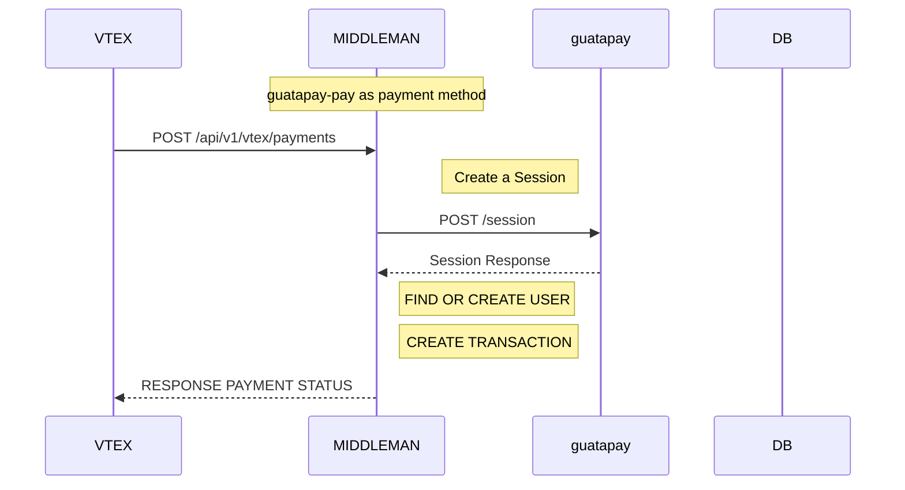
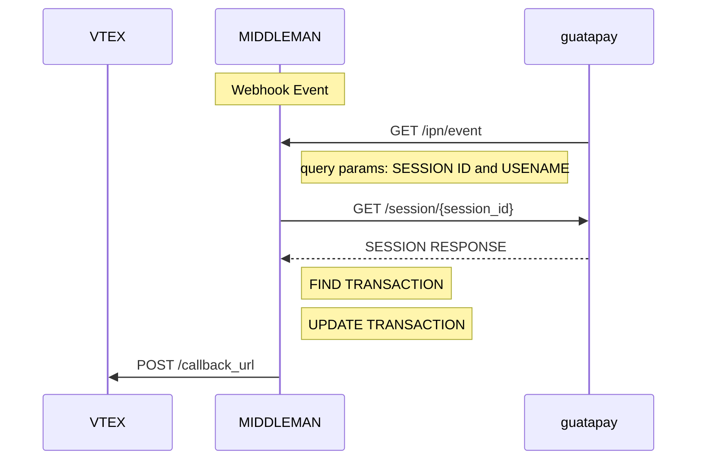
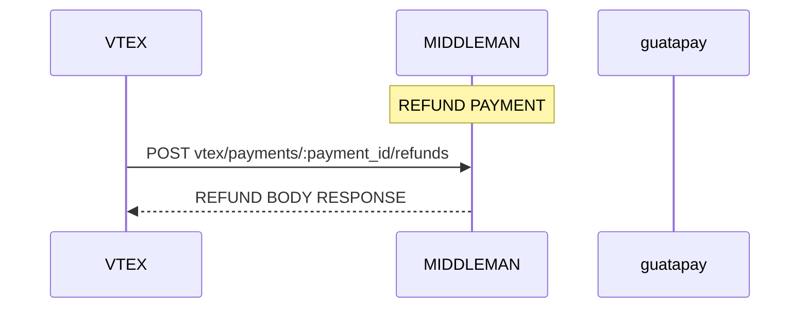
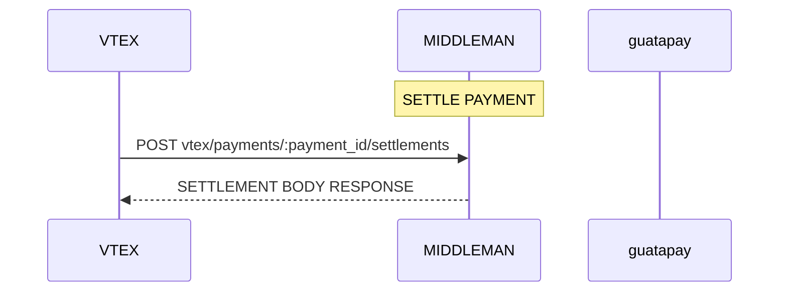
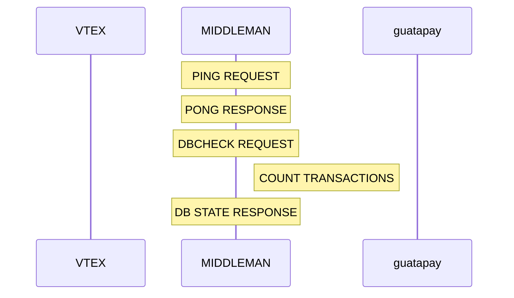

# VTEX - GUATAPAY

## Manual Installation

Clone the repo:

```bash
git clone https://gitlab.com/conexa-projects/guatapay-vtex/backend-vtex
```

Install the dependencies:

```bash
yarn install
```

Set the environment variables:

```bash
cp .env.example .env

#open .env and modify the environment variables (if needed)
```

## Table of Contents

- [Features](#features)
- [Commands](#commands)
- [Branching](#branching)
- [Making Changes](#making-changes)
- [Committing Changes](#committing-changes)
- [Committing Rules](#committing-rules)
- [Environment Variables](#environment-variables)
- [Project Structure](#project-structure)
- [API Documentation](#api-documentation)
- [Sequence Diagrams](#sequence-diagrams)
- [Error Handling](#error-handling)
- [Logging](#logging)
- [Custom Mongoose Plugins](#custom-mongoose-plugins)
  - [To JSON Plugin](#tojson)
  - [Paginate Plugin](#paginate)
- [Linting](#linting)
- [Contributing](#contributing)
- [Inspirations](#inspirations)
- [License](#license)

## Features

- **ES9**: latest ECMAScript features
- **Static Typing**: [TypeScript](https://www.typescriptlang.org/) static typing using typescript
- **Hot Reloading**: [Concurrently](https://github.com/open-cli-tools/concurrently) Hot realoding with concurrently
- **NoSQL database**: [MongoDB](https://www.mongodb.com) object data modeling using [Mongoose](https://mongoosejs.com)
- **Validation**: request data validation using [Joi](https://github.com/hapijs/joi)
- **Logging**: using [winston](https://github.com/winstonjs/winston) and [morgan](https://github.com/expressjs/morgan)
- **Testing**: unit and integration tests using [Jest](https://jestjs.io)
- **Error handling**: centralized error handling mechanism
- **API documentation**: with [postman-to-openapi](https://www.npmjs.com/package/postman-to-openapi) and [swagger-ui-express](https://github.com/scottie1984/swagger-ui-express)
- **Process management**: advanced production process management using [PM2](https://pm2.keymetrics.io)
- **Dependency management**: with [Yarn](https://yarnpkg.com)
- **Environment variables**: using [dotenv](https://github.com/motdotla/dotenv) and [cross-env](https://github.com/kentcdodds/cross-env#readme)
- **Security**: set security HTTP headers using [helmet](https://helmetjs.github.io)
- **Santizing**: sanitize request data against xss and query injection
- **CORS**: Cross-Origin Resource-Sharing enabled using [cors](https://github.com/expressjs/cors)
- **Compression**: gzip compression with [compression](https://github.com/expressjs/compression)
- **Code coverage**: using [codecov](https://about.codecov.io/)
- **Code quality**: with [Codacy](https://www.codacy.com)
- **Linting**: with [ESLint](https://eslint.org) and [Prettier](https://prettier.io)
- **Editor config**: consistent editor configuration using [EditorConfig](https://editorconfig.org)
 - **Git hooks**: using [Husky](https://typicode.github.io/husky/#/) and [Lint Staged](https://github.com/okonet/lint-staged)
 - **Commit linting**: using [Commitlint](https://commitlint.js.org/#/)
- **Structured Commit Messages**: using [Commitizen](https://github.com/commitizen/cz-cli)
- **Docker**: using [Docker](https://www.docker.com)
- **CI/CD**: using [Gitlab CI](https://docs.gitlab.com/ee/ci/)


## Commands


Running locally:

```bash
yarn dev
```

Running in production:

```bash
yarn start
```

Compiling to JS from TS

```bash
yarn build
```

Compiling to JS from TS in watch mode

```bash
yarn build:watch
```

Commiting changes

```bash
yarn commit
```

Generating Documentation (Postman to Swagger):

```bash
yarn generate:docs
```

Testing:

```bash
# run all tests
yarn test

# run TypeScript tests
yarn test:ts

# run JS tests
yarn test:js

# run all tests in watch mode
yarn test:watch

# run test coverage
yarn coverage
```

Docker:

```bash
# run docker container in development mode
yarn docker:dev

# run docker container in production mode
yarn docker:prod

# run all tests in a docker container
yarn docker:test
```


Linting:

```bash
# run ESLint
yarn lint

# fix ESLint errors
yarn lint:fix

# run prettier
yarn prettier

# fix prettier errors
yarn prettier:fix
```


## Branching
We use [GitFlow](https://www.atlassian.com/git/tutorials/comparing-workflows/gitflow-workflow) branching model.

Your branch name should follow one of the following formats:
- `feature/feature-name` for new features
- `fix/fix-name` for bug fixes
- `chore/chore-name` for chores
- `docs/docs-name` for documentation
- `refactor/refactor-name` for refactors
- `release/release-name` for releases
- `revert/revert-name` for reverts
- `test/test-name` for tests
- `wip/wip-name` for work in progress
- `ci/ci-name` for continuous integration

## Making Changes

Run `yarn dev` so you can compile Typescript(.ts) files in watch mode

```bash
yarn dev
```

Add your changes to TypeScript(.ts) files which are in the src folder. The files will be automatically compiled to JS if you are in watch mode.

Add tests for the new feature

Run `yarn test:ts` to make sure all Typescript tests pass.

```bash
yarn test:ts
```

## Committing Changes
  Run `yarn commit` to commit your changes. This will run commitizen which will guide you through the commit process.

```bash
yarn commit
```


## Committing Rules
We use **The Conventional Commits** specification. It is a convention that provides an easy set of rules for creating an explicit commit history; which makes it easier to write automated tools on top of. This convention dovetails with SemVer, by describing the features, fixes, and breaking changes made in commit messages.

#### Commit types ``required`` ``lowercase``

``feat`` – a new feature is introduced with the changes

``fix`` – a bug fix has occurred

``chore`` – changes that do not relate to a fix or feature and don't modify src or test files (for example updating dependencies)

``refactor`` – refactored code that neither fixes a bug nor adds a feature

``docs`` – updates to documentation such as a the README or other markdown files

``style`` – changes that do not affect the meaning of the code, likely related to code formatting such as white-space, missing semi-colons, and so on.

``test`` – including new or correcting previous tests

``perf`` – performance improvements

``ci`` – continuous integration related

``build`` – changes that affect the build system or external dependencies

``revert`` – reverts a previous commit

```sh
echo ": some message"    # fails
echo "foo: some message" # fails
echo "FIX: some message" # fails
echo "fix: some message" # passes
```


#### Scope ``optional`` ``lowercase``

```sh
echo "fix(SCOPE): some message" # fails
echo "fix(scope): some message" # passes
```

#### Description ``required`` ``start in lowercase`` ``not ending in "."``

```sh
echo "fix:" # fails
echo "fix: some message." # fails
echo "fix(scope): Some message" # fails
echo "fix(scope): some message" # passes
echo "fix(scope): some Message" # passes
```
Examples:
```sh
echo "fix(.gitignore): added node_modules folder" 
echo "fix(controllers/auth): added frontend redirect params"
echo "revert(services/email): nodemailer version update"
```

## Environment Variables

The environment variables can be found and modified in the `.env` file. They come with these default values:

```bash
- PORT=5420
- NODE_ENV=development
- API_URL="https://guatapay-vtex-api.conexa.ai"
- MONGODB_URL=mongodb://guatapay-vtex-bd:27028/guatapay-vtex
- VTEX_API=""
- VTEX_TOKEN=""
- guatapay_URL="https://uat.guatapay.com/api/v1"
- guatapay_API_KEY=""
- guatapay_USER=""
```

| Environment Variable | Description | Default Value  |
| -------------------- | ----------- | -------------- |
| `PORT` | The port number of the server | `5420` |
| `API_URL` | The URL of the API | `http://localhost:$PORT` |
| `VTEX_API` | vtex API key| `empty` |
| `VTEX_TOKEN` | vtex API token| `empty` |
| `NODE_ENV` | The environment to execute| `development` |
| `guatapay_URL` | guatapay API URL| `https://uat.guatapay.com/api/v1` |
| `guatapay_API_KEY` | guatapay API key| `empty` |
| `guatapay_USER` | guatapay username| `empty` |
| `MONGODB_URL` | The URL of the Mongo DB | `mongodb://


## Project Structure

```
.
├── src                               # Source files
│   ├── interfaces                    # Types and interfaces
│   ├── config                        # Environment variables and other configurations
│   ├── controllers                   # Controllers
│   ├── docs                          # Documentation files (Postman, Swagger)
│   ├── lib                           # Utility functions
│   ├── middlewares                   # Middlewares
│   ├── models                        # Models (Mongooose)
│   ├── routes                        # Routes
│   ├── services                      # Services
│   ├── tests                         # Tests
│   ├── validations                   # Joi validations
│   ├── app.ts                        # Express App
│   ├── custom.d.ts                   # File for extending types from node modules
│   ├── declaration.d.ts              # File for declaring modules without types
│   ├── index.ts                      # App entry file
├── package.json
└── README.md
```

### API Endpoints

List of available routes (base path: `/api/v1`):

**VTEX routes**:\
`GET /vtex/manifest` - Get Manifest
`GET /vtex/payment-methods` - Get Payment methods
`POST /vtex/payments` - Make a payment from vtex
`POST /vtex/payments/:payment_id/settlements` - Make a settlement
`POST /vtex/payments/:payment_id/cancellation` - Cancel payment
`POST /vtex/payments/:payment_id/refunds` - Refund payment

**Webhook routes**:\
`GET /ipn/event` - Instant payment notification from guatapay-vtex\

**Vitals routes**:\
`GET /` - GET a welcome message from server
`GET /vitals/ping` - GET a PING - PONG from server
`GET /vitals/dbCheck` - GET a status of database

**Documentation routes**:\
`GET /docs` - Swagger documentation
### Sequence Diagrams

#### PAYMENT TRANSACTION


#### WEBHOOK


#### CANCELLATIONS


#### REFUNDS


#### SETTLEMENT


#### VITALS


## Error Handling

The app has a centralized error handling mechanism.

Controllers should try to catch the errors and forward them to the error handling middleware (by calling `next(error)`). For convenience, you can also wrap the controller inside the catchAsync utility wrapper, which forwards the error.

```javascript
import { catchAsync } from "conexa-core-server"

const controller = catchAsync(async (req, res) => {
  // this error will be forwarded to the error handling middleware
  throw new Error('Something wrong happened');
});
```

The error handling middleware sends an error response, which has the following format:

```json
{
  "success": false,
  "code": 404,
  "message": "Not found"
}
```

When running in development mode, the error response also contains the error stack.

The app has a utility ApiError class to which you can attach a response code and a message, and then throw it from anywhere (catchAsync will catch it).

For example, if you are trying to get a user from the DB who is not found, and you want to send a 404 error, the code should look something like:

```javascript
const httpStatus = require('http-status');
const ApiError = require('../utils/ApiError');
const User = require('../models/User');

const getUser = async (userId) => {
  const user = await User.findById(userId);
  if (!user) {
    throw new ApiError(httpStatus.NOT_FOUND, 'User not found');
  }
};
```

## Logging

Import the logger from `conexa-core-server`. It is using the [Winston](https://github.com/winstonjs/winston) logging library.

Logging should be done according to the following severity levels (ascending order from most important to least important):

```javascript
import { Logger } from "conexa-core-server";

logger.error('message'); // level 0
logger.warn('message'); // level 1
logger.info('message'); // level 2
logger.http('message'); // level 3
logger.verbose('message'); // level 4
logger.debug('message'); // level 5
```

In development mode, log messages of all severity levels will be printed to the console.

In production mode, only `info`, `warn`, and `error` logs will be printed to the console.\
It is up to the server (or process manager) to actually read them from the console and store them in log files.\
This app uses pm2 in production mode, which is already configured to store the logs in log files.

Note: API request information (request url, response code, timestamp, etc.) are also automatically logged using out Http Logger found in the **conexa-core-server** package (which implements [morgan](https://github.com/expressjs/morgan)).

## Custom Mongoose Plugins

The app also contains 2 custom mongoose plugins that you can attach to any mongoose model schema. You can find the plugins in `src/models/plugins`.

```javascript
const mongoose = require('mongoose');
const { toJSON, paginate } = require('./plugins');

const userSchema = mongoose.Schema(
  {
    /* schema definition here */
  },
  { timestamps: true }
);

userSchema.plugin(toJSON);

const User = mongoose.model('User', userSchema);
```

### toJSON

The toJSON plugin applies the following changes in the toJSON transform call:

- removes \_\_v, createdAt, updatedAt, and any schema path that has private: true
- replaces \_id with id

## Linting

Linting is done using [ESLint](https://eslint.org/) and [Prettier](https://prettier.io).

In this app, ESLint is configured to follow the [Airbnb JavaScript style guide](https://github.com/airbnb/javascript/tree/master/packages/eslint-config-airbnb-base) with some modifications. It also extends [eslint-config-prettier](https://github.com/prettier/eslint-config-prettier) to turn off all rules that are unnecessary or might conflict with Prettier.

To modify the ESLint configuration, update the `.eslintrc.json` file. To modify the Prettier configuration, update the `.prettierrc.json` file.

To prevent a certain file or directory from being linted, add it to `.eslintignore` and `.prettierignore`.

To maintain a consistent coding style across different IDEs, the project contains `.editorconfig`

## License

[CONEXA]


